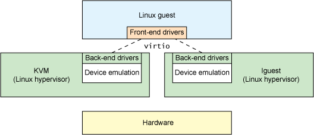

# 文件系统

## 概况

文件系统主要要实现以下几个任务：

1. 创建磁盘镜像并写入编译好的用户程序
2. 将虚拟磁盘接入qemu
3. 以扇区为单位读写虚拟磁盘(virtio_disk.c)
4. 构建block io层，建立block cache以缓存频繁读写的扇区(bio.c)
5. 实现fat32层，提供对fat32文件系统的解析与操作(fat32.c)
6. 实现inode层，将fat32中的每个文件抽象为inode以提供类似于VFS那样的同一文件接口。同时还要实现inode cache，以缓存频繁读写的文件元数据(file.c)
7. 实现file层，实现文件描述符并提供基于此的文件读写功能

## 创建FAT32的磁盘镜像

由于比赛要求使用FAT32文件系统，所以我们只需要创建一个空FAT32磁盘镜像文件，然后将其挂载到本地环境的某个目录下，然后将编译好的文件拷贝到这个目录下，最后卸载这个目录，等运行qemu时再指定这个磁盘镜像文件即可，而不需要自己写一个类似于xv6的mkfs.c那样的程序来把用户程序写入磁盘。

### 创建空FAT32磁盘镜像
```bash
# 创建磁盘镜像
dd if=/dev/zero of=fs.img bs=512 count=512
# 格式化为FAT32文件系统
mkfs.vfat -F 32 -s 4 fs.img
```
- mkfs 是“make filesystem”的缩写，而 vfat 是指 FAT32 文件系统的一种变种，支持长文件名。
- -F 32：这个选项指定文件系统的类型为 FAT32。
- -s 4：这个选项指定每个分配单元的扇区数。扇区是磁盘存储的基本单元，大多数情况下，一个扇区的大小是 512 字节。这里 -s 4 表示每个簇（FAT文件系统中的分配单元）包含4个扇区，因此每个簇的大小为 2048 字节（4 * 512）。

### 挂载镜像并写入编译好的文件
```bash
mount fs.img \\mnt
cp app \\mnt
umount \\mnt
```

### 在Makefile中的具体写法
```makefile
dst=/mnt
# Make fs image
fs.img:
	@if [ ! -f "fs.img" ]; then \
		echo "making fs image..."; \
		dd if=/dev/zero of=fs.img bs=512 count=512; \
		mkfs.vfat -F 32 -s 4 fs.img; fi
	@sudo mount fs.img $(dst)
	-@make sdcard dst=$(dst)
	@sudo umount $(dst)
	@echo "fs image is ready"
```
如果此处没有fs.img文件就会创建一个，然后挂载到/mnt目录下，然后调用make sdcard dst=/mnt，最后卸载/mnt目录。由于sdcard是只有在fs.img不存在时才会执行，而不是fs.img在语法上依赖于sdcard，所以每次更新user文件后都需要删除fs.img并重新make fs.img才能应用user中的更新。

sdcard目标的规则如下：
```makefile
sdcard: user
	@for file in $$( ls $U/_* ); do \
		sudo cp $$file $(dst)/$${file#$U/_}; done

USER_C_FILES := $(wildcard $U/*.c)
USER_O_FILES := $(USER_C_FILES:.c=.o)
USER_BASE_NAMES := $(notdir $(USER_C_FILES))
UPROGS= $(patsubst %.c, $U/_%, $(USER_BASE_NAMES))
ULIB = 
ulinker = $U/user.ld

_%: %.o $(ULIB)
	$(LD) $(LDFLAGS) -T $(ulinker) -o $@ $^
	$(OBJDUMP) -S $@ > $*.asm

user: $(UPROGS)
```
这里sdcard把user文件夹下的所有_\*文件复制到挂载了磁盘镜像的/mnt中去，此处的_\*是user文件夹下所有.c文件编译后的可执行文件，之所以要加_前缀，是为了和内核的编译文件进行区分，防止内核编译文件应用user程序的编译规则。user程序的编译规则在_%目标中被定义。

## 读取虚拟磁盘（virtio_disk）

### virtio概要

virtio是半虚拟化的解决方案，对半虚拟化Hypervisor的一组通用I/O设备的抽象。它提供了一套上层应用与各 Hypervisor 虚拟化设备（KVM，Xen，VMware等）之间的通信框架和编程接口。

而我们就是利用virtio在qemu创建了一块虚拟磁盘设备x0，同时将x0连接到virtio mmio总线上。具体参数如下：
```bash
qemu ... -drive file=fs.img,if=none,format=raw,id=x0 -device virtio-blk-device,drive=x0,bus=virtio-mmio-bus.0
```
要读取虚拟磁盘就是要实现一个virtio驱动库，该库通过virtio mmio总线与虚拟磁盘进行通信。

### 与virtio通信的具体方式
主要与两个数据结构挂钩: 描述符数组（virtq_desc）、待处理指令队列（virtq_avali）、已完成指令队列（virtq_used）。
初始化时，驱动需要将这三个数据结构的地址通过mmio的方式通知给虚拟磁盘。

进行具体读写操作时，描述符数组会作为储存操作指令本身的内存区域，每条完整的操作指令由3个描述符数据体以链的方式构成，通过每个操作符数据体在描述符数组中的位置来进行索引。

待处理指令队列会按时间先后顺序储存每条操作指令链的头部描述符的索引与当前所有指令的条数（包括已处理的）。由虚拟磁盘端（即设备端）按顺序一条条处理。完成后会更新当前处理完的指令条数并引发外部中断来通知驱动端。

虚拟磁盘端在完成某条指令时还会在已完成队列的这条指令的索引（即这是以完成的第几条指令）处写入这条指令的操作指令链的头部描述符索引，并将完成状态写到这条指令的操作指令链中所指定的地方。

描述符数组是可以回收利用的，而待处理指令队列和已完成指令队列则是通过循环队列的方式实现的，初始化时驱动会将循环队列的大小通过mmio告知给虚拟磁盘端。

## block_io层的实现

定义一个buffer数据体数组block_cache与buffer链表head，每个buffer数据体都在链表中。每个使用中的buffer会映射到一个扇区，每次读写一个扇区时，从链头往链尾找是否有对应的buffer，若有直接读写，若没有则从链尾往链头找到第一个refcnt=0（即没有被某个指针指向）的buffer，将其绑定到对应的扇区，然后读写。每次释放一个扇区时，若对应buffer的refcnt=0，则将其移动至链尾。
同时我们还实现了延迟写入的功能，只有当一个之前被写入过的buffer要变动其绑定的扇区或者操作系统准备退出时，才会把这个扇区写入磁盘。

## FAT32层的实现

### FAT32文件系统的结构

主要可以分为三个部分：
- 启动扇区（Boot Sector）：存储文件系统的基本信息，包括文件系统的类型、磁盘的总容量、每个簇的扇区数。
- 文件分配表（File Allocation Table）：存储对簇的描述信息的表，信息可能为以下几种之一：
    1. 链中下一个簇的地址
    1. 一个特殊的簇链结束符（EOC，End Of Cluster-chain，或称End Of Chain）符号指示链的结束
    1. 一个特殊的符号标示坏簇
    1. 一个特殊的符号标示保留簇
    1. 0来表示空闲簇
- 数据区（Data Area）：存储文件的实际数据。其中包含了根目录区域。
详细结构可见Wiki：[FAT32](https://zh.wikipedia.org/wiki/%E6%AA%94%E6%A1%88%E9%85%8D%E7%BD%AE%E8%A1%A8)
另外再推荐两篇博客：
  - https://www.cnblogs.com/Chary/p/12981056.html
  - https://www.cnblogs.com/caishunzhe/p/12833008.html

#### 根目录区域

此处对根目录区域进行一定的说明。在fat12与fat16中它是紧接在fat区域后面的，而在fat32中并非如此。启动扇区中有根目录起始簇号的信息，而可以根据下面的公式计算出某个簇对应的起始扇区：
$$ 簇号起始扇区 = （簇号-2）* 每个簇的扇区数 + 隐藏扇区数 + 保留扇区数 + FAT数*每个FAT占扇区数 $$
公式中的量均可在启动扇区中找到其对应值。
根目录区域储存根目录下的目录项。

#### 目录项

fat32有两种目录项，一种是短目录项，一种是长目录项。短目录项是8.3命名规则，而长目录项是为了支持长文件名而设计的。
而且fat32中每个文件或目录都会同时有短目录项和长目录项，长目录项位于短目录项之前。

1. 短目录项
    - 每个文件或目录对应一个，占32字节。
    - 储存文件的基本信息，如文件名（过长则截取为短文件名）、文件属性、文件大小、文件的起始簇号等。
2. 长目录项
    - 每一个项占32字节，基本只保存文件名的信息。
    - 一个文件文件名过长时可能对应多个长目录项（至少会有一个），它们逆序排在该文件的短目录项前。
    - 第一个字节存储顺序号或标志该项空闲或标志该文件已被删除。

